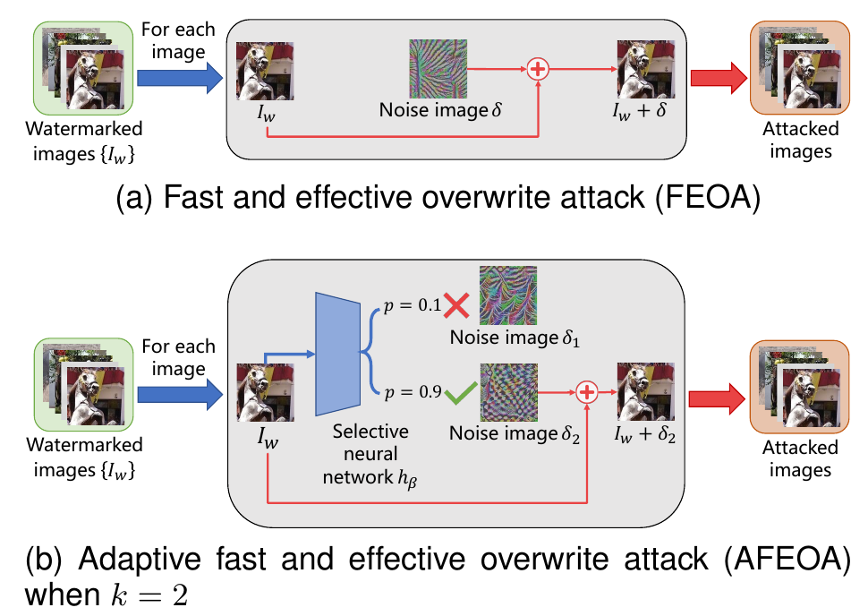

# Fast and Effective Overwrite Attack Against DNN-Based Image Watermarking Models

Official implementation of the paper published in *IEEE Transactions on Multimedia*.

Shaoxin Li, Xiaofeng Liao, Qiqi Zhang, Yuanqi Xue, and Lingyang Chu

[Paper PDF](https://lingyangchu.github.io/Papers/TMM25_Fast.pdf) · [IEEE Xplore](https://doi.org/10.1109/TMM.2025.3632696) · [Citation](#citation)

## Overview

FEOA learns one reusable noise image to overwrite watermark messages across many images. AFEOA learns a set of noise images and selects one for each input.

<p align="center">
  
</p>

*Figure 1 from the paper. AFEOA is illustrated with two noise images.*

Both methods train offline and attack new images without retraining. An L2 constraint limits the added noise. White-box attacks train against the victim decoder; black-box attacks use a learned surrogate decoder. Training uses watermarked images with known messages, but attacking a new image does not require its true message.

The paper evaluates watermarking models on COCO and ImageNet, with attack training images drawn from Conceptual Captions. See Section VI for the experimental settings and results.

## Usage

> The released runners need integration fixes before they can run end to end. The commands below document their intended configuration. See [release status](#release-status) for the known blockers.

### Environment

The original environment uses Python 3.8.10, PyTorch 1.12.1, and torchvision 0.13.1 with CUDA 11.3. The full dependency list is in [requirements.txt](requirements.txt).

```bash
git clone https://github.com/ShaoxinLi/Fast-and-Effective-Overwrite-Attack.git
cd Fast-and-Effective-Overwrite-Attack
python3.8 -m venv .venv
source .venv/bin/activate
python -m pip install -r requirements.txt \
  --extra-index-url https://download.pytorch.org/whl/cu113
```

The pinned CUDA builds target NVIDIA GPUs. See the [PyTorch installation instructions](https://pytorch.org/get-started/previous-versions/#v1121).

### Data and checkpoints

Prepare watermarked images, their ground-truth messages in `watermarks.npy`, and a matching watermarking-model checkpoint. The repository does not bundle datasets or pretrained checkpoints.

For `--dataset coco`, the data loader expects this layout under `--data-root-dir`:

```text
Datasets/
└── coco10k/
    ├── train/
    │   ├── images/
    │   │   └── *.png
    │   └── watermarks.npy
    └── test/
        ├── images/
        │   └── *.png
        └── watermarks.npy
```

Put images in a subdirectory for `torchvision.datasets.ImageFolder`; the name `images/` is arbitrary. Keep watermark rows aligned with image order. Set `--message-length` and `--img-size` to match the model and prepared data. The loaders use `imagenet10k/` for `--dataset imagenet` and `ConceptualCaption/` for `--dataset cc`.

### FEOA

Example configuration for HiDDeN with 30-bit messages and 128 × 128 images:

```bash
python run_feoa.py \
  --watermarking-model hd \
  --wm-ckpt-file-path /path/to/checkpoint.pth \
  --data-root-dir /path/to/Datasets \
  --dataset coco \
  --message-length 30 \
  --img-size 128
```

### AFEOA

Use `--k` to set the number of learned noise images:

```bash
python run_afeoa.py \
  --k 100 \
  --watermarking-model hd \
  --wm-ckpt-file-path /path/to/checkpoint.pth \
  --data-root-dir /path/to/Datasets \
  --dataset coco \
  --message-length 30 \
  --img-size 128
```

The CLI name for HiDDeN is `hd`. Both runners default to a batch size of 16 and a learning rate of `1e-3`. FEOA defaults to 50 epochs; AFEOA defaults to 80 epochs and `k=100`. The paper uses `k=150` and 100 epochs for AFEOA unless stated otherwise. Full reproduction also requires the dataset splits and evaluation settings in Section VI.

## Code

| Method | Entry point | Implementation |
| --- | --- | --- |
| FEOA | [run_feoa.py](run_feoa.py) | [`UOA`](src/attacks/uoa.py) |
| AFEOA | [run_afeoa.py](run_afeoa.py) | [`AUOA`](src/attacks/auoa.py) |

## Release status

The current source release has known integration gaps:

- Both attack runners import `src.models`, which is absent from the repository.
- [src/utils/config.py](src/utils/config.py) calls `MySummaryWriter`, whose definition is commented out.
- The data loaders return a dataset and message array, while the attack runners pass that pair directly to `DataLoader`. They also pass `args.decoder` to testing after assigning the loaded model to `args.model`.

## Citation

If you use this work, please cite the paper. The entry below uses the final volume and page numbers.

```bibtex
@article{li2026fast,
  title   = {Fast and Effective Overwrite Attack Against {DNN}-Based Image Watermarking Models},
  author  = {Li, Shaoxin and Liao, Xiaofeng and Zhang, Qiqi and Xue, Yuanqi and Chu, Lingyang},
  journal = {IEEE Transactions on Multimedia},
  volume  = {28},
  pages   = {1119--1132},
  year    = {2026},
  doi     = {10.1109/TMM.2025.3632696}
}
```
